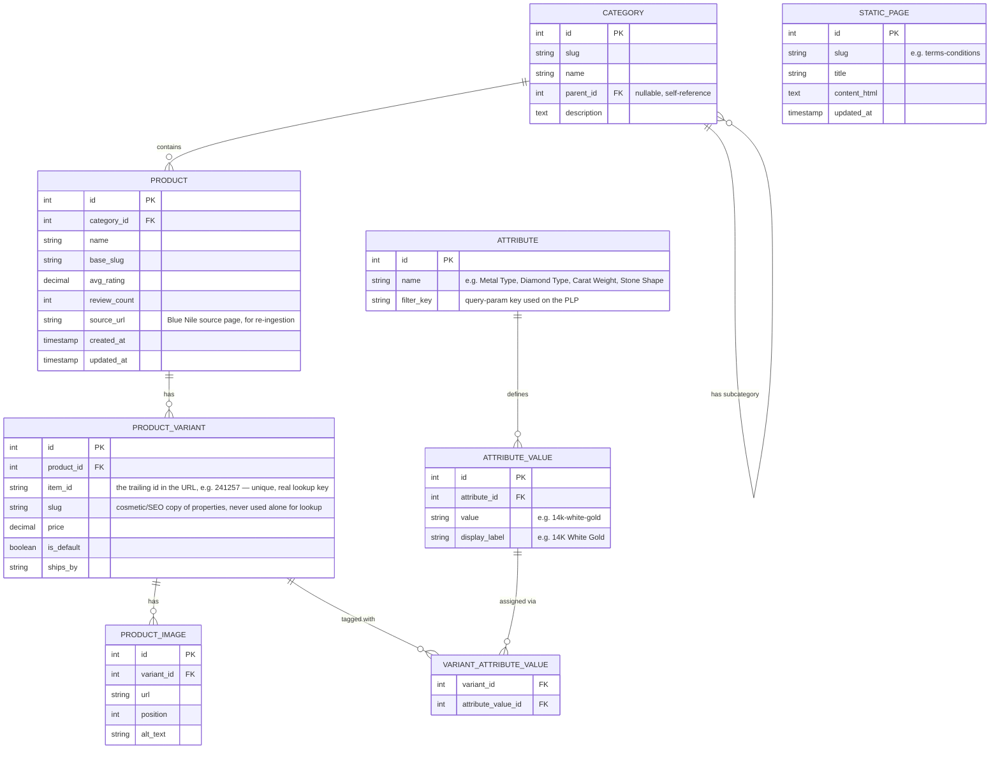

No existing ER diagram in the repo — this is the initial data model for the storefront.

Notes:
- `PRODUCT` is the "style" (e.g. *Low Dome Basket Lab-Grown Diamond Eternity Ring*); `PRODUCT_VARIANT` is the specific sellable configuration addressed by the URL's trailing `item_id`. This mirrors Blue Nile's own PDP, where changing metal/carat/diamond type on one page can move you to a different `item-#####`.
- `VARIANT_ATTRIBUTE_VALUE` is the single source of truth for both the PDP's variant selectors and the PLP's filter chips — no duplicated attribute data between the two pages.
- No table is proposed for the 1-day TTL cache — it is an application-level, in-memory construct (see [technical-design.md](technical-design.md)), not durable state, so it doesn't belong in the schema.
