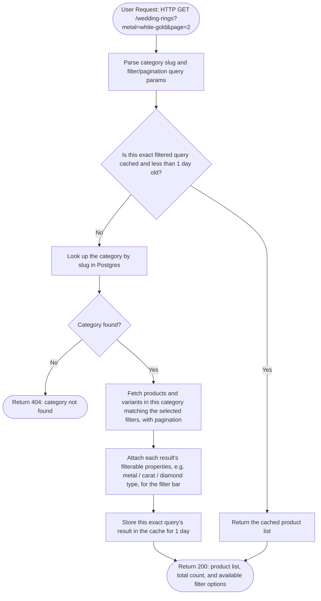

## Flow 1 — Catalog page (PLP) request



## Flow 2 — Product detail page (PDP) request

```mermaid
flowchart TD
  A([User Request: HTTP GET /wedding-rings/low-dome-basket...-item-241257]) --> B[Extract the product id, "241257", from the end of the URL]
  B --> C{Is this product id cached and less than 1 day old?}
  C -- Yes --> D[Return the cached product detail]
  C -- No --> E[Look up the product variant by its id in Postgres]
  E --> F{Variant found?}
  F -- No --> G([Return 404: product not found])
  F -- Yes --> H[Load the parent product, all sibling variants, images, and properties]
  H --> I[Build the variant selector options, e.g. other available metals/carats for this style]
  I --> J[Store this product's detail in the cache for 1 day]
  J --> K([Return 200: product detail, price, images, and variant options])
  D --> K
```
