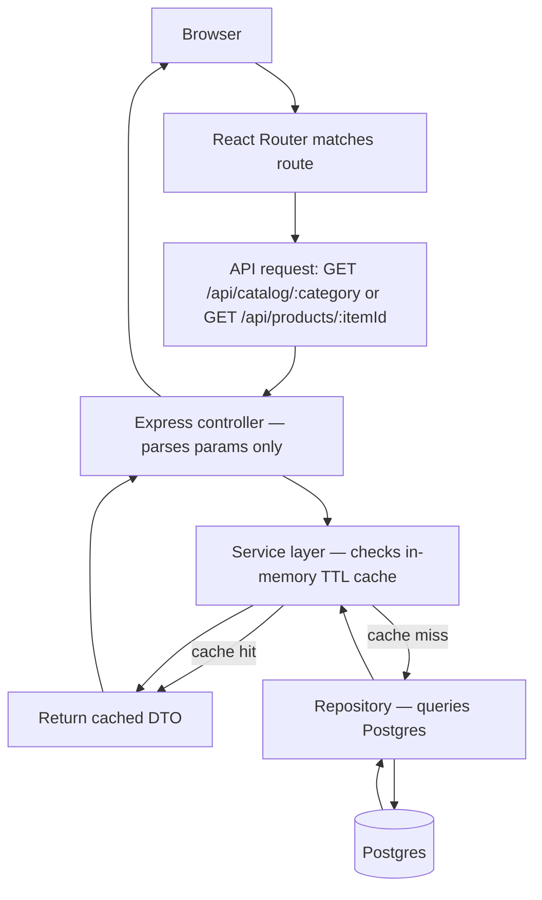

## Architecture changes

Repo is currently empty of application code — this is the initial scaffold. Follows `rules/architecture.md` / `CLAUDE.md` feature-module layout exactly.

```
/src
  /features
    /catalog
      catalog.controller.ts   ← parses category slug + filter/pagination query params
      catalog.service.ts      ← cache check, filter/pagination logic
      catalog.repository.ts   ← Postgres queries (products, variants, attributes)
      catalog.routes.ts
      catalog.types.ts
      catalog.test.ts
    /products
      products.controller.ts  ← parses trailing item_id out of the PDP URL
      products.service.ts     ← cache check, sibling-variant assembly
      products.repository.ts
      products.routes.ts
      products.types.ts
      products.test.ts
    /pages
      pages.controller.ts     ← serves static content pages (terms, privacy, etc.)
      pages.service.ts
      pages.repository.ts
      pages.routes.ts
      pages.types.ts
      pages.test.ts
  /shared
    /db        ← pg pool setup, migration runner
    /cache     ← in-memory TTL cache (single module, no Redis)
    /errors    ← NotFoundError, ValidationError
    /utils
  /infra
    /ingestion ← one-off/periodic script that seeds ~1,000 products from the source category pages into Postgres
  app.ts / server.ts

/web (React app)
  /src
    /routes
      CatalogPage.tsx     ← /:category
      ProductPage.tsx     ← /:category/:productSlugAndId
      StaticPage.tsx      ← /terms-conditions etc.
    /components
      Header.tsx / Footer.tsx
      FilterBar.tsx / Pagination.tsx
      VariantSelector.tsx / ImageGallery.tsx
```

## Data flow



## Deployment shape (low-infra)
- `server` and `web` each get a multi-stage Dockerfile; `docker-compose.yml` runs `postgres` + `server` + `web` together, so `docker compose up` is full local parity and the same images are what ship to a single small VPS/host — no orchestration platform needed at this scale.
- `web`'s runtime stage is `nginx:alpine` serving the Vite build output as a static SPA (with a `try_files ... /index.html` fallback for client-side routing); it never runs Node at runtime.
- Build stages use `node:22-slim` (glibc), not `node:22-alpine` — Vite's `rollup` dependency ships platform-specific optional binaries that the npm lockfile resolves for glibc; building on musl (Alpine) fails with a missing-native-module error. `server`'s Alpine stages are unaffected since `tsc`/`express`/`pg` have no native-binary dependency.

## API contracts
- `GET /api/categories/:slug/products?metal=&caratMin=&caratMax=&diamondType=&stoneShape=&sort=&page=&pageSize=&q=`
  → `{ items: ProductListItemDTO[], total: number, page: number, pageSize: number, availableFilters: FilterOptionDTO[] }`
- `GET /api/products/:itemId`
  → `{ id, name, slug, price, images: string[], attributes: AttributeValueDTO[], siblingVariants: VariantSummaryDTO[] }`
- `GET /api/pages/:slug`
  → `{ title: string, contentHtml: string, updatedAt: string }`

Frontend route → API mapping:
- `/:category` → `GET /api/categories/:category/products`
- `/:category/:slugAndId` → controller extracts trailing `-item-(\d+)$` from `:slugAndId`, calls `GET /api/products/:itemId`
- `/terms-conditions`, etc. → `GET /api/pages/terms-conditions`

## DB changes
- Initial migration creating all tables in [er-diagram.md](er-diagram.md)
- Indexes: `category.slug` (unique), `product_variant.item_id` (unique — the real lookup key), composite index on `variant_attribute_value(variant_id, attribute_value_id)` for filter queries, `product.category_id`

## Caching design (low-infra constraint)
- No Redis/external cache service. A single in-process `Map`-based TTL cache (`shared/cache`) keyed by the full normalized query string (catalog) or `item_id` (PDP), TTL = 1 day (86400s), per [CLAUDE.md](../../CLAUDE.md) infra budget.
- Known limitation: cache is per-process — lost on restart/deploy, not shared across horizontally scaled instances. Acceptable at 1,000-product / low-traffic scale; not solved in v1.

## Dependencies to add
- Backend: `express`, `pg`, a migration tool (`node-pg-migrate` — lightweight, no ORM overhead)
- Frontend: `react`, `react-router-dom`, `vite` — plain CSS modules to keep bundle size down and match Blue Nile's layout without a heavy component library
- Ingestion: the Playwright MCP tool already available in this environment, used as a one-off/periodic script — not called at request time

## Risks and mitigations
1. **Legal/IP risk — flagging explicitly, needs your sign-off before this goes live.** Building an "exact replica" of Blue Nile's PDP/PLP styling, and hotlinking their own product photography, for a live competing commercial brand (barebrilliant.com) risks copyright/trademark exposure — the photography and page design are Blue Nile's IP. **Mitigation:** scope this build as an internal styling/UX prototype; before any public launch, swap hotlinked images for BareBrilliant's own licensed photography and restyle the markup so it isn't a verbatim copy. Recommend legal review before go-live.
2. **Hotlinking fragility** — Blue Nile can add referrer/hotlink protection or rotate CDN URLs at any time, silently breaking every product image. Mitigation: `ProductImage.url` is just data — swapping to self-hosted URLs later is a data migration, not a code change.
3. **Ingestion drift** — the one-time ~1,000-product import goes stale as Blue Nile's catalog/pricing changes. Mitigation: ingestion script is idempotent (upsert by `source_url`/`item_id`) and documented as a manual, periodic (e.g. monthly) re-run — not a live sync.
4. **Slug/lookup ambiguity** — PDP route must never resolve a product from the slug text alone (attribute values can be renamed later). Mitigation: repository layer only ever looks up by `item_id`; the slug is display-only.
5. **Single-process cache** — see Caching design above; documented limitation, not solved now.
